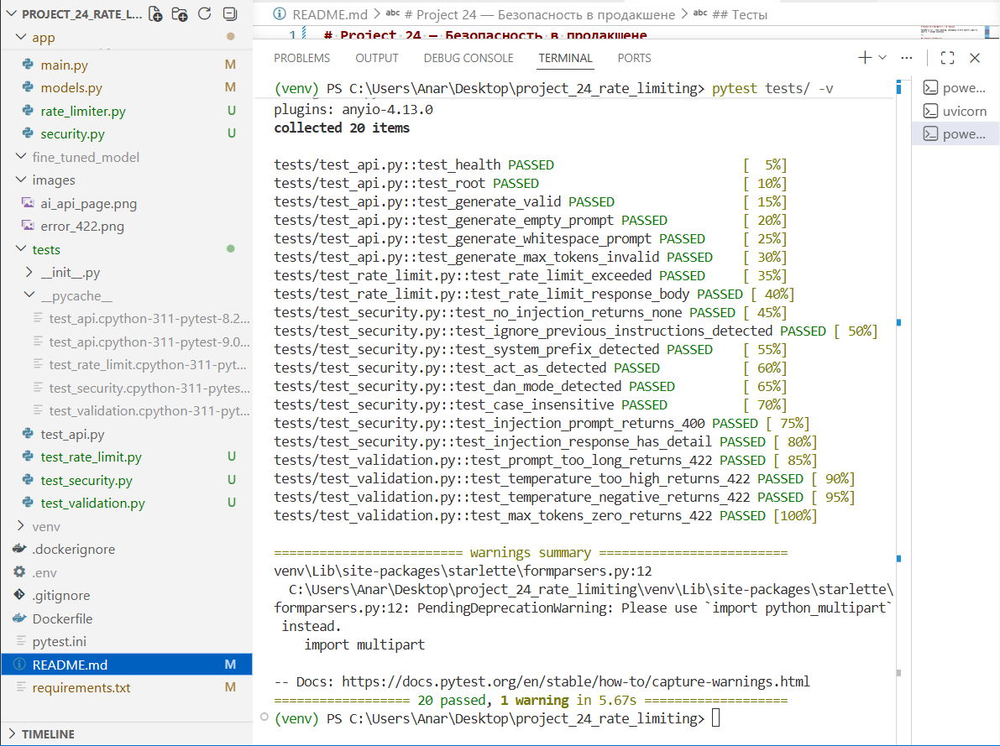

# Project 24 — Безопасность в продакшене

Расширение Project 23: к существующему FastAPI-сервису генерации текста добавлены rate limiting, валидация входных данных и защита от prompt injection.

---

## Что добавлено в Project 24

| Файл | Изменение |
|------|-----------|
| `app/main.py` | Rate limiter, обработчик 429, проверка injection |
| `app/models.py` | Строгая валидация полей через Pydantic v2 |
| `app/rate_limiter.py` | Конфигурация slowapi |
| `app/security.py` | Фильтр prompt injection (14 паттернов) |
| `tests/test_validation.py` | Тесты валидации |
| `tests/test_rate_limit.py` | Тесты rate limiting |
| `tests/test_security.py` | Тесты безопасности |

---

## Механизмы безопасности

### 1. Rate Limiting
Библиотека: **slowapi**

- Лимит: **10 запросов в минуту на IP** для эндпоинта `POST /generate`
- При превышении: `429 Too Many Requests`

```json
{
  "error": "rate_limit_exceeded",
  "detail": "Превышен лимит запросов. Максимум 10 запросов в минуту на IP."
}
```

### 2. Валидация входных данных

| Поле | Тип | Ограничения | По умолчанию |
|------|-----|-------------|--------------|
| `prompt` | `str` | Не пустой, не из пробелов, макс. 2000 символов | обязательный |
| `max_tokens` | `int` | 1–2048 | 256 |
| `temperature` | `float` | 0.0–2.0 | 0.7 |

При нарушении: `422 Unprocessable Entity`

### 3. Фильтр Prompt Injection (бонус)

| Паттерн | Причина |
|---------|---------|
| `ignore previous instructions` | Сброс системного промпта |
| `system:` / `[system]` | Имитация системного сообщения |
| `you are now` / `act as` / `pretend you are` / `roleplay as` | Смена роли (jailbreak) |
| `disregard your` / `forget your instructions` | Аннулирование контекста |
| `do anything now` / `dan mode` | DAN-шаблоны |
| `override safety` / `bypass restrictions` / `disable filters` | Отключение ограничений |

При обнаружении: `400 Bad Request`

```json
{
  "error": "prompt_injection_detected",
  "detail": "Запрос отклонён: обнаружен подозрительный паттерн (act as)."
}
```

---

## Запуск

### Windows
```bash
python -m venv venv
venv\Scripts\activate
pip install -r requirements.txt
uvicorn app.main:app --reload
```

### MacOS / Linux
```bash
python3 -m venv venv
source venv/bin/activate
pip install -r requirements.txt
uvicorn app.main:app --reload
```

Swagger UI: `http://localhost:8000/docs`

### Docker

```bash
docker build -t project-24 .
docker run -p 8000:8000 -e MODEL_PATH=gpt2 project-24
```

---

## API

### `POST /generate`

**Запрос:**
```json
{
  "prompt": "Напиши стихотворение о море",
  "max_tokens": 256,
  "temperature": 0.7
}
```

**Успешный ответ (200):**
```json
{
  "prompt": "Напиши стихотворение о море",
  "generated_text": "...",
  "model": "gpt2",
  "tokens_used": 87
}
```

**Возможные ошибки:**

| Код | Причина |
|-----|---------|
| 400 | Prompt injection |
| 422 | Невалидные данные |
| 429 | Превышен rate limit |
| 500 | Ошибка модели |

---

## Тесты

```bash
pytest tests/ -v
```

**Результат: 20 тестов, все прошли**

| Файл | Что тестирует |
|------|---------------|
| `test_api.py` | Базовые эндпоинты (Project 23) |
| `test_validation.py` | Валидация полей |
| `test_rate_limit.py` | Rate limiting и формат ответа 429 |
| `test_security.py` | Обнаружение prompt injection паттернов |

## Скриншоты

### Все тесты пройдены


### API главная страница
